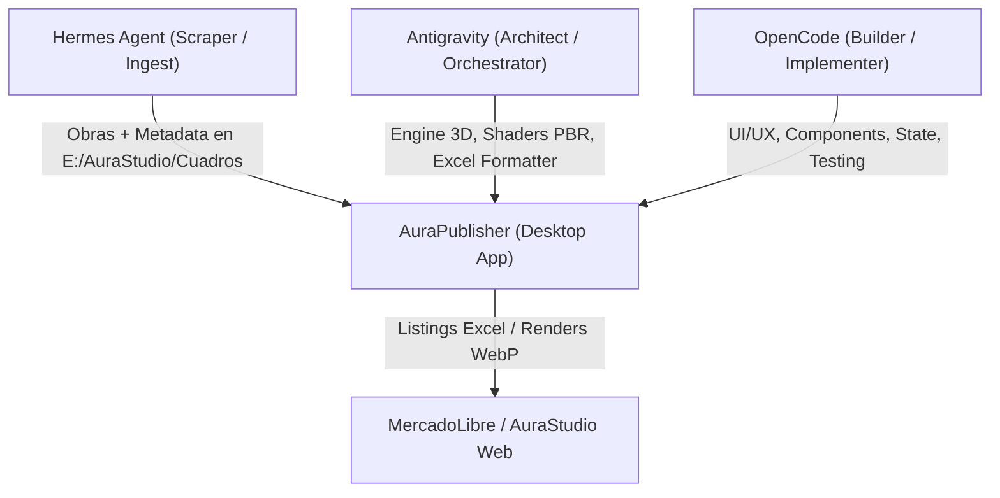

# AuraPublisher — AGENTS.md

Reglas operativas y mapa de arquitectura para cualquier agente o AI trabajando en este repositorio.

---

## 1. System Overview

**AuraPublisher** es una aplicación Desktop de alto rendimiento construida con **Electron + Vite + React 19 + Three.js**. Su propósito es la calibración fotorealista de mockups 3D, indexación masiva de catálogo de obras y generación/exportación de planillas Excel masivas de publicación para **MercadoLibre Argentina (MLA)** con estricta conformidad a especificaciones oficiales.

---

## 2. Stack & Comandos

- **Runtime & UI**: Node 22+, Electron 34, React 19, Three.js 0.170, `@react-three/fiber`, Zustand 5, Sharp, SheetJS (xlsx).
- **Tooling**: Vite 6, TypeScript 5.7.3 strict, electron-builder 25.
- **Comandos**:
  - `npm run dev`: Inicia el entorno de desarrollo Vite + Electron en caliente.
  - `npm run build`: Typecheck TypeScript, bundle Vite y empaquetado Electron para Windows.
  - `npm run build:portable`: Genera el ejecutable portable `.exe` en `/release`.
  - `npx tsc --noEmit`: Verificación estricta de tipos TypeScript sin emitir artefactos.

---

## 3. Architectural Map

### 3.1. Main Views (`src/components/Workspace/`)
1. **`library`** ([`LibraryView.tsx`](file:///H:/Projects/AuraPublisher/src/components/Workspace/LibraryView.tsx)): Exploración, filtrado y selección de catálogo (películas, series, anime, videojuegos, arte), gestión de pósters y estados de selección.
2. **`mockups`** ([`MockupGridView.tsx`](file:///H:/Projects/AuraPublisher/src/components/Workspace/MockupGridView.tsx)): Grid interactivo de ambientes y plantillas de mockups, calibración de encuadres y previsualización.
3. **`publisher`** ([`MassPublisherView.tsx`](file:///H:/Projects/AuraPublisher/src/components/Workspace/MassPublisherView.tsx)): Orquestador de renderizado por lotes, exportación masiva y validación de listings.
4. **`pricing`** ([`PricingSettingsView.tsx`](file:///H:/Projects/AuraPublisher/src/components/Workspace/PricingSettingsView.tsx)): Configuración de matrices de precios, coeficientes de ganancia, costos fijos y dimensiones por acabado (Vinilo vs Resina).

### 3.2. Core Engines (`src/engine/`)
- **3D WebGL Room Engine** ([`webglRoomEngine.ts`](file:///H:/Projects/AuraPublisher/src/engine/webglRoomEngine.ts)):
  - Shaders PBR personalizados y mapeo de materiales.
  - Sistema de iluminación multi-luz dinámico con hasta 4 fuentes lumínicas configurables (`LightSource3D`).
  - Quad de perspectiva con puntos de fuga y deformación proyectiva precisa (`PerspectiveQuad`).
  - Capa de resina líquida PBR ultra-realista: `roughness: 0.002`, `clearcoat: 1.0`, `envMapIntensity: 6.0`, `specularIntensity: 3.0`.
- **Pro Color Grading** ([`colorGrading.ts`](file:///H:/Projects/AuraPublisher/src/engine/colorGrading.ts)):
  - Curvas de tonos y Look-Up Tables (LUT) de 256 entradas por canal RGB.
  - Bandas tonales quirúrgicas: Blacks, Shadows, Whites, Highlights.
  - Balance de blancos (temperatura, tinte), saturación, tono y viñeteado diferencial para obra y fondo.
- **Catalog Scanner** ([`catalogScanner.ts`](file:///H:/Projects/AuraPublisher/src/engine/catalogScanner.ts)):
  - Indexación nativa vía IPC de Electron sobre el storage local `E:\AuraStudio\Cuadros`.
  - Fallback automático a `embeddedCatalogData.json` (430+ títulos precacheados).
- **Copywriting & SEO** ([`copyGenerator.ts`](file:///H:/Projects/AuraPublisher/src/engine/copyGenerator.ts)):
  - Títulos SEO para MercadoLibre con degradación estricta en 5 fases (garantía 100% `<= 60 caracteres`).
  - Fórmulas de copy: `Cuadro Resina Epoxi Premium {Título} Aura Studio` / `Cuadro Vinilico Premium HD {Título} Aura Studio`.
  - Generación de descripciones persuasivas en texto plano sin markdown/HTML compatible con ML.
- **Excel Exporter** ([`excelExporter.ts`](file:///H:/Projects/AuraPublisher/src/engine/excelExporter.ts)):
  - Lectura e inyección en plantilla oficial de MercadoLibre: `H:\AuraStudio\Publicar-08-13-09_35_15.xlsx` (o `src/assets/templates/Publicar-08-13-09_35_15.xlsx`).
  - Mapeo completo de 40 columnas (hoja "Cuadros Decorativos"): SKU, variantes por acabado/medida, fotos, stock, fórmulas `=LEN(...)`, precios y especificaciones técnicas.

---

## 4. Shared Resources & Data Pipelines

- **Repositorio de Obras**: `E:\AuraStudio\Cuadros` (Organizado por categorías: anime, cine, gaming, series; contiene imágenes de alta resolución e índices JSON de metadata).
- **Plantillas de Ambientes**: `E:\AuraStudio\Mockups` (Fondos de living, dormitorio, oficina, galería para composiciones 3D).
- **Planilla Maestra de Publicación**: `H:\AuraStudio\Publicar-08-13-09_35_15.xlsx`.

---

## 5. Universal Tri-Agent Protocol

El ecosistema AuraStudio / AuraPublisher opera bajo una división tripartita y complementaria de responsabilidades:

1. **Antigravity (Orchestrator & System Architect)**:
   - Diseño matemático y estructural: Shaders WebGL, cálculo de perspectiva por puntos de fuga, algoritmos de exportación Excel y arquitectura del core.
   - Definición de directivas maestras y compatibilidad de datos entre aplicaciones.
2. **OpenCode (Builder & UI Specialist)**:
   - Implementación de componentes React 19, navegación, paneles de control (Inspector, Presets, History).
   - Optimización de interactividad en tiempo real y pruebas locales.
3. **Hermes Agent (Asset Ingestion & Catalog Scraper)**:
   - Scraping automatizado, descarga de pósters en alta resolución y extracción de metadata (TMDB/IGDB/MAL).
   - Estructuración directa de carpetas en `E:\AuraStudio\Cuadros`.

---

## 6. Reglas de Modificación para Agentes

1. **No tocar parámetros de shaders de resina sin justificación**: La resina epoxi líquida está calibrada (`roughness: 0.002`, `clearcoat: 1.0`, `envMap: 6.0`, `specular: 3.0`) para match fotográfico.
2. **Respetar límite de 60 caracteres en títulos ML**: Todo cambio en `copyGenerator.ts` debe pasar la degradación de 5 fases sin exceder 60 caracteres.
3. **Preservar estructura de columnas de Excel**: `excelExporter.ts` debe respetar el orden exacto de 40 columnas de la plantilla oficial de MercadoLibre.
4. **Consultar y actualizar el ledger**: Antes y después de cada sesión de trabajo, registrar estado en `docs/agent-sync.md`.
